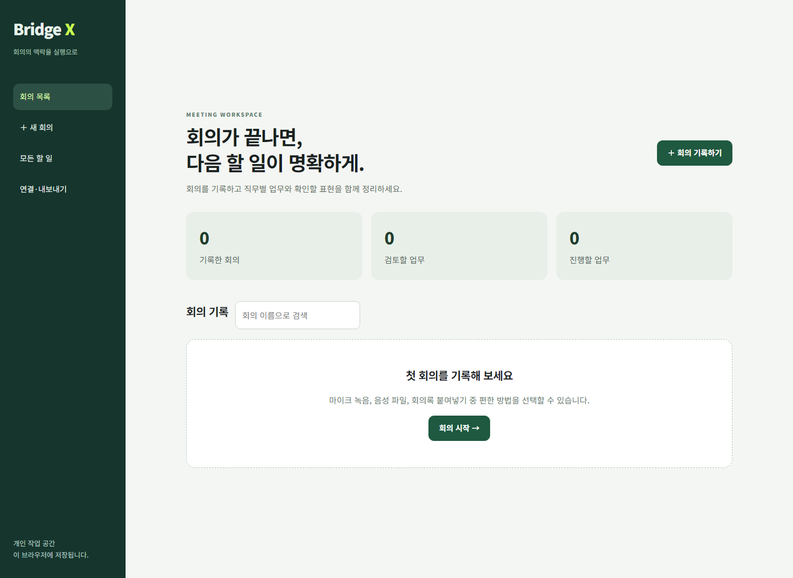

# Bridge X

> 회의가 끝나는 순간, 서로 다르게 이해한 말을 함께 실행할 수 있는 일로 바꿉니다.

Bridge X는 회의 음성을 기록·전사하고, 결정과 할 일을 직무별로 구조화하며, 오해가 생길 수 있는 표현과 도메인 용어를 원문 근거와 함께 보여주는 **회의 실행 정렬(Execution Alignment) 워크스페이스**입니다.

**배포 서비스:** [https://bridge-x-omega.vercel.app](https://bridge-x-omega.vercel.app)



## 해결하려는 문제

회의록이나 요약 도구는 ‘무슨 말을 했는지’를 남기지만, 실제 협업 실패는 그다음에 발생합니다.

- PM·디자인·개발·운영이 같은 표현을 서로 다른 완료 조건으로 이해합니다.
- “빠르게”, “우선”, “가능하면” 같은 말은 담당자·기한·우선순위가 없는 채 실행으로 넘어갑니다.
- 문화권과 직무별 용어 차이가 번역 이후에도 남습니다.
- 회의 결과를 다시 캘린더나 업무 문서로 옮기는 과정에서 맥락과 근거가 사라집니다.

Bridge X는 단순 요약이 아니라 **말 → 근거가 있는 실행 항목 → 사람이 검토한 합의**의 흐름을 만듭니다.

## 현재 구현된 사용자 흐름

1. `새 회의`에서 회의명과 참석 직무를 설정합니다.
2. 브라우저에서 녹음하거나 음성 파일을 선택하고, 동의 확인 후 AI로 전사합니다.
3. 사용자가 전사문을 직접 확인·수정합니다.
4. AI가 요약, 결정사항, 직무별 할 일, 확인할 표현, 용어 가이드를 생성합니다.
5. 각 할 일의 담당자·기한·우선순위·완료 조건을 사람이 수정하고 `검토 완료`로 확정합니다.
6. Notion용 Markdown 또는 캘린더용 ICS 파일로 내보냅니다.

## 핵심 기능

- 마이크 녹음 및 오디오 파일 전사
- 회의 전사문 편집과 세션 임시 저장
- 담당 직무, P1/P2/P3 우선순위, 기한, 선행 조건, 완료 기준이 포함된 할 일 추출
- 모호하거나 오해 가능성이 있는 표현과 정확한 원문 인용 표시
- 직무·도메인 용어의 의미와 확인 질문 제안
- AI 생성 상태와 사용자 검토 완료 상태의 명확한 구분
- 회의별 상세 탭과 전체 할 일 모아보기
- Markdown 및 ICS 파일 내보내기
- 모바일·데스크톱 반응형 UI

## AI 활용

- **OpenAI 음성 전사 모델:** 회의 음성을 텍스트로 변환합니다.
- **OpenAI Responses API + Structured Outputs:** 결과를 고정된 데이터 구조로 생성합니다.
- **Zod 검증:** 서버에서 AI 출력 형식을 다시 검증합니다.
- **근거 우선 설계:** 할 일과 위험 표현에는 전사문의 실제 인용문을 연결합니다.
- **Human-in-the-loop:** AI 결과는 초안이며, 사용자가 담당자·기한·완료 조건을 검토해야 확정됩니다.

API 키는 서버 환경변수로만 사용하며 브라우저에 전달하지 않습니다. `.env`는 Git에서 제외됩니다.

## 빠른 실행

필요 환경: Node.js 20 이상

```bash
npm install
copy .env.example .env
npm run dev
```

- Web: http://localhost:5173
- API health: http://localhost:8787/api/health

`.env`에 `OPENAI_API_KEY` 또는 `LLM_API_KEY`를 설정하면 실제 전사와 AI 분석을 사용할 수 있습니다.

## 주요 명령어

```bash
npm run dev       # Web + API 실행
npm run build     # production build
npm test          # API와 분석 로직 테스트
```

## 기술 구성

- Frontend: React, TypeScript, Vite
- Backend: Node.js, Express, TypeScript, Zod
- AI: OpenAI Responses API Structured Outputs, OpenAI Speech-to-Text
- Deployment: Vercel Functions + Vercel Hosting
- Persistence: 브라우저 localStorage 기반 프로토타입

## 프로젝트 구조

```text
apps/web/                  React 사용자 화면
apps/api/                  분석·전사 로직과 Express API
api/                       Vercel Functions 진입점
docs/MEETING-IMPLEMENTATION.md
                            구현 범위와 한계
docs/SUBMISSION_BRIEF.md   공모전 제출용 문안
docs/DEMO_SCRIPT.md        3분 발표·시연 순서
docs/SUBMISSION_CHECKLIST.md
                            제출 직전 확인표
```

## 현재 범위와 한계

현재 버전은 심사와 사용자 검증을 위한 웹 프로토타입입니다. 회의와 할 일은 해당 브라우저에 저장되며, 팀 계정·서버 DB·실시간 공동 편집은 아직 없습니다. Notion과 캘린더는 OAuth 직접 연동이 아니라 Markdown/ICS 파일 내보내기 방식입니다. 문화적 해석은 확정 판단이 아니라 오해 가능성과 확인 질문을 제안하는 보조 정보로 다룹니다.

다음 단계는 팀 계정과 서버 저장, 실제 Notion·Google Calendar 연동, 조직별 용어집, 발화자 분리, 사용자 평가 데이터 기반 품질 개선입니다.

## 제품의 방향

Bridge X가 만들려는 것은 범용 회의 요약기나 번역기가 아닙니다. 핵심은 **서로 다른 직무와 문화권의 사람들이 같은 회의를 실제로 같은 방향으로 실행하도록 돕는 협업 운영 계층**입니다. 회의에서 시작해 문서, 메신저, 업무 관리 도구로 확장하되, 모든 결과에 원문 근거와 사람의 검토 상태를 남기는 것이 제품 원칙입니다.
